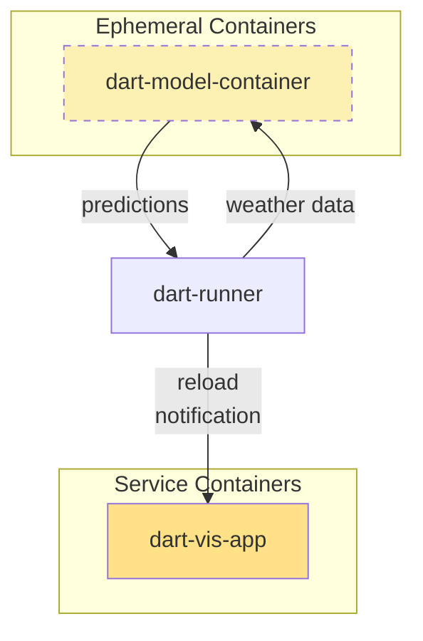

# dart-runner

Orchestrates DART-Pipeline runs with forecast downloads and model predictions

The architecture diagram is shown below:


*Components*:

- dart-runner: this repository, orchestrates the pipeline
- [dart-pipeline](https://github.com/kraemer-lab/DART-Pipeline): fetches and processes forecast data
- [dart-bias-correct](https://github.com/kraemer-lab/dart-bias-correct): performs bias correction
- dart-model-container: ML model to run predictions based on processed weather
  data
- docker-dart-vis-app: Frontend visualisation of predictions

## Installation

We use the [`uv`](https://docs.astral.sh/uv/#installation) package manager to
manage installation of dart-runner. Follow the linked instructions, or install
using your package manager.

First, clone the repository, and run the main file with the `--help` option. This will install dependencies, without actually running the pipeline

```shell
git clone https://github.com/DART-Vietnam/dart-runner
cd dart-runner
uv run main.py --help
```

The `cdo` package also needs to be installed to perform resampling:

```shell
brew install cdo    # macOS
apt install cdo     # Debian/Ubuntu
```

To run dart-runner, at least 40 GB of disk space is required to download and
process forecast data, which dart-runner will check before starting.

**Required files for bias correction**: A couple of files are required for bias
correction, which are not included in this repo due to size and/or license
restrictions. These are the historical ERA5 observational reanalysis data for
Vietnam (`T2m_r_tp_Vietnam_ERA5.nc`) and the historical forecast data for
Vietnam (`eefh_testv2_test_githubv1_3.nc`). These files have to be obtained from
the authors and placed in the folder where this repository was cloned.

## Usage

dart-runner can be invoked from the command line:
```shell
uv run main.py
```

Running with no parameters automatically fetches the latest forecast from ECMWF,
performs bias correction and zonal statistics, and runs a dummy model. If
`dart-vis-app` is running, then a reload notification is sent to the frontend
(via creating a `.reload` flag file in the output folder).

Full options can be seen by running
```shell
uv run main.py --help
```

Some of the key options are:

* `--date`: to specify a date other than today's forecast, in YYYY-MM-DD format
* `--model`: to run the actual model, specify `--model=actual-1`. The default is
  `--model=dummy`
* `--cache`: to cache only specified steps; by default all steps (see above) are cached to speed up execution

## Development

Install [pre-commit](https://pre-commit.com) and setup pre-commit hooks
(`pre-commit install`) which will do linting checks before commit.
